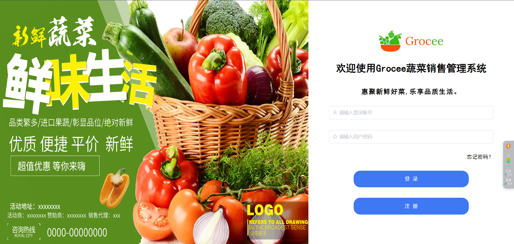
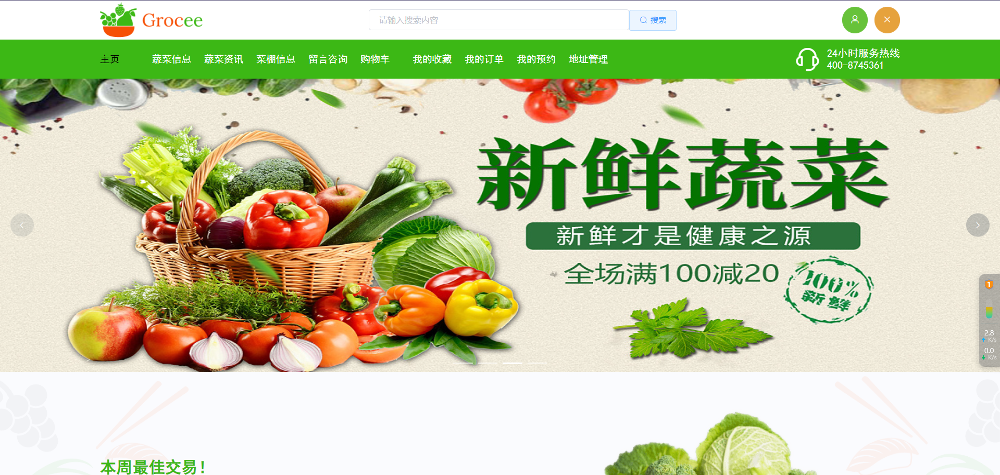
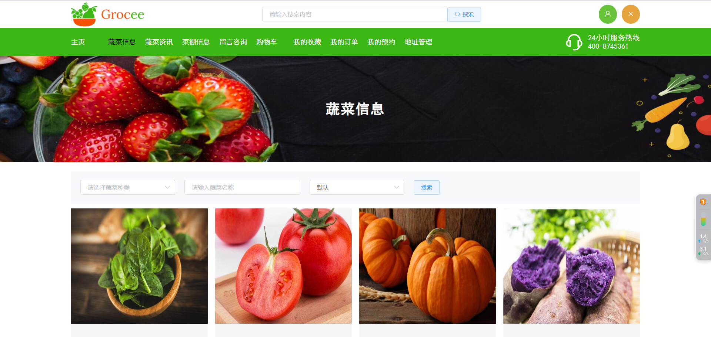
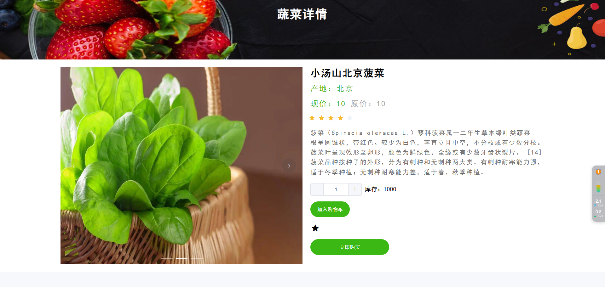
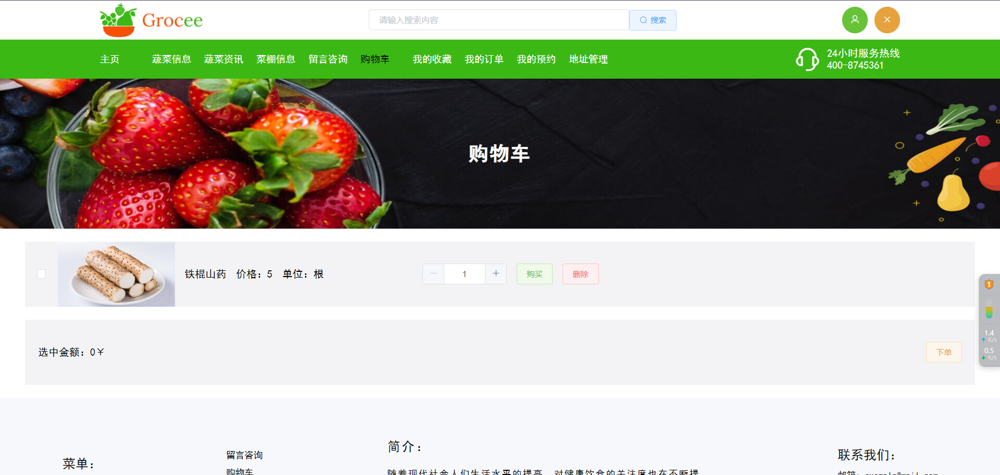
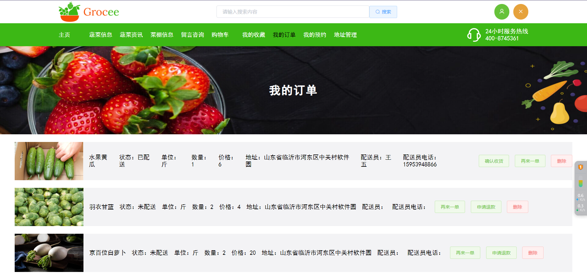
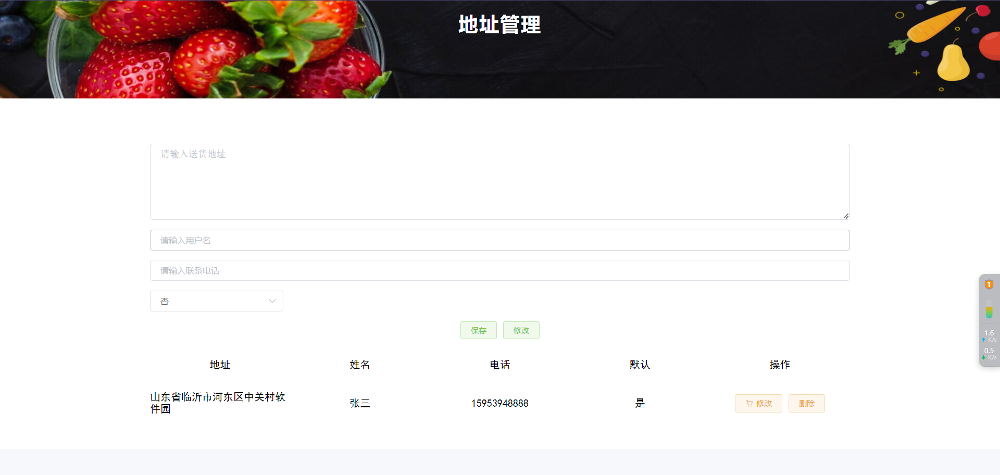
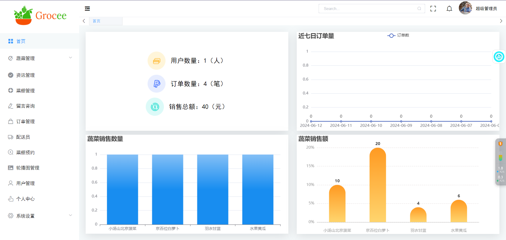

# 基于SpringBoot+Vue的网上蔬菜销售系统的设计与实现

 **有问题或获取源码可以咨询企鹅Q1760272627**
 
 **系统运行视频** 
https://www.bilibili.com/video/BV1im411r79c/?vd_source=5f273f72fd3dc593e25c33cbccdad12e
 
### 功能：
用户：登录、注册、忘记密码、主页、蔬菜信息、下单、蔬菜咨询、收藏、购物车、菜棚预约、留言、我的订单、地址管理、个人中心

管理员：首页、蔬菜类型、蔬菜管理、咨询管理、菜棚管理、留言咨询、订单管理、配送员管理、菜棚预约、轮播图管理、用户管理、个人中心、系统设置

### 采用技术：
SpringBoot，shiro，Mybatis-plus，Vue，redis，mysql，ElementUi，echarts

### 工具：
idea，vscode，navicat

### 系统截图：

 **有问题或获取源码可以咨询企鹅Q1760272627**
